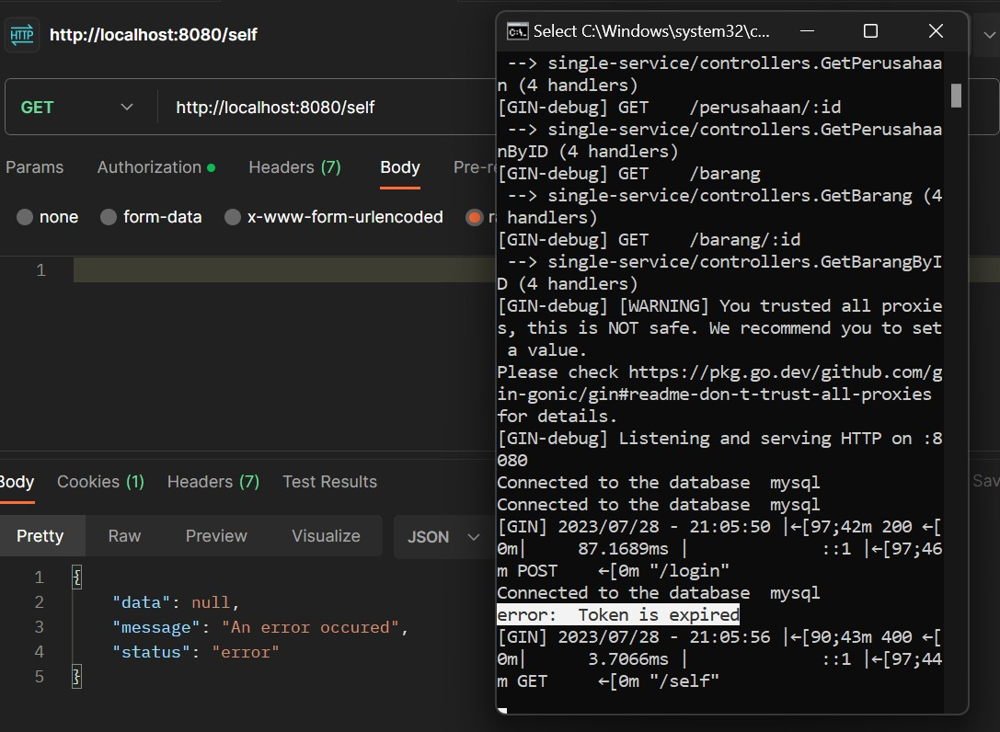

# Single Service - Back-End

## Description
Service ini menyediakan API yang digunakan sebagai back-end untuk aplikasi [Monolith](https://github.com/frendysanusi05/Monolith-Fullstack)

<br>

## List of Contents
1. [Description](#description)
2. [Tech Stack](#tech-stack)
3. [Design Patterns](#design-patterns)
4. [How to Run](#how-to-run)
5. [API Endpoints](#api-endpoints)
6. [Bonuses](#bonuses)
7. [Made with Love by](#made-with-love-by)

<br>

## Tech Stack
### Tech
* Golang v1.19
* Gin v1.9.1                => framework Golang
* Gorm v1.9.16              => ORM (Object Relational Mapper)
* Docker-compose v2.19.1    => container
* Postman                   => API testing tools

### Database
* MySQL v8.0.34
* DBeaver        => DBMS Tools

<br>

## Design Patterns
1. Chain of Responsibility

Digunakan untuk menghubungkan berbagai objek dalam sebuah rantai sehingga dapat dilakukan penanganan request secara terurut. Alur perjalanan request adalah Middlewares -> Routes -> Controllers -> Models -> Views -> Databases

2. MVC (Model-View-Controller)

Diimplementasikan oleh struktur MVC (Model-View-Controller) sehingga setiap directory memiliki fungsinya masing-masing dan mudah dilakukan maintenance

3. Decorator

Diimplementasikan oleh directory middleware untuk menghindari penulisan kode berulang saat mengecek otorisasi pada endpoint-endpoint private

<br>

## How to Run
1. Clone repository ini

2. Masuk ke directory
```
cd /SingleService-Backend
```

3. Buat file .env dengan command berikut
* Windows
``` 
copy .env.example .env 
```

* Linux
``` 
cp .env.example .env 
```

4. Jika menggunakan Docker Desktop, jalankan aplikasi tersebut terlebih dahulu

5. Pada terminal/cmd, jalankan command berikut.
``` 
docker-compose up 
```

<br>

## API Endpoints
### Admin Endpoints
| No | HTTP Method  | Endpoints          | Access    |
| -- | ------------ | ------------------ | --------- |
| 1  | POST         | /login             | Admin     |
| 2  | GET          | /self              | Admin     |

### Barang Endpoints
| No | HTTP Method  | Endpoints          | Access    |
| -- | ------------ | ------------------ | --------- |
| 1  | GET          | /barang            | All       |
| 2  | POST         | /barang            | Admin     |
| 3  | GET          | /barang/:id        | All       |
| 4  | UPDATE       | /barang/:id        | Admin     |
| 5  | DELETE       | /barang/:id        | Admin     |

### Perusahaan Endpoints
| No | HTTP Method  | Endpoints          | Access    |
| -- | ------------ | ------------------ | --------- |
| 1  | GET          | /perusahaan        | All       |
| 2  | POST         | /perusahaan        | Admin     |
| 3  | GET          | /perusahaan/:id    | All       |
| 4  | UPDATE       | /perusahaan/:id    | Admin     |
| 5  | DELETE       | /perusahaan/:id    | Admin     |

<br>

## Bonuses
### B01 - OWASP
Sedikit teori mengenai OWASP dapat ditemukan di website [Try Hack Me](https://tryhackme.com/room/owasptop10)

* Cryptographic Failure

Serangan ini dilakukan apabila penyusup mampu memperoleh data sensitif dari hasil MITM (Man-In-The-Middle Attack). Misalkan penyusup memperoleh data user dan password, namun password masih dalam bentuk enkripsi.


Terlihat bahwa penyusup tidak berhasil melakukan login. Hal ini karena backend melakukan enkripsi password menggunakan bcrypt yang belum ditemukan metode dekripsinya.


* Injection

Metode injection yang digunakan adalah SQL injection, salah satu metode yang paling umum digunakan. Thanks to GORM, service tidak dapat diinjeksi.


* Identification and Authentication Failure

Serangan ini dilakukan apabila penyusup memperoleh akun yang masih dalam keadaan login. Serangan dilakukan menggunakan cookie.




Terlihat bahwa walaupun masih terdapat cookie, penyusup tetap tidak dapat mengambil data admin karena cookie memiliki session. Ketika session habis, cookie tidak dapat digunakan kembali. Sesi percobaan dilakukan dengan mengeset session cookie = 0 detik


### B07 - API Documentation
I created API documentation using swagger. See the docs [here](https://app.swaggerhub.com/apis-docs/FRENDYVIVO5/single-service/1.0.0).

<br>

## Made with Love by
Frendy Sanusi - 18221041

Sistem dan Teknologi Informasi

Institut Teknologi Bandung
